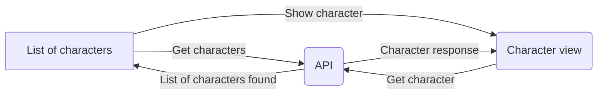

# Rick and Morty App!

Esta aplicación tiene como objetivo poner a prueba las habilidades del desarrollador.

## Desafío

Crear una aplicación web el cual contenga las descripciones de todos los personajes de la serie **Rick and Morty** .
> **Nota:** Para este desafió deberás usar React o Vuejs, puedes usar también algunas librerías de diseño como son [Ant Design](https://ant.design), [Material-UI](https://material-ui.com), [React bootstrap](https://react-bootstrap.github.io), entre otros.

### Instrucciones

Deberas consumir la siguiente API REST  [The Rick and Morty API](https://rickandmortyapi.com)

 1. Primera vista: 
	- Obtener la lista de todos los personajes, esta vista deberá desplegarse en un [GRID](https://developer.mozilla.org/es/docs/Web/CSS/CSS_Grid_Layout) y debera mostrarse como una lista de tarjetas [Card view](https://material.io/develop/android/components/cards/), el cual deben desplegarse los siguentes datos del personaje mas importantes del personaje, [tomar como referencia la misma pagina para estas tarjetas](https://rickandmortyapi.com).
	- Deberá tener un buscador de personajes por nombre.
 2. Segunda vista: al hacer clic a un personaje de la vista anterior deberá llevar a una nueva vista y desplegar. todos los datos de este.
 3. Todas las vistas deben ser responsivas recuerda "Mobile First".
 4. Al terminar tu proyecto, envía el Link de tu repositorio a tu reclutador.

### Indicaciones Generales.
Puedes usar cualquier librería para el diseño de la UI incluso si lo quieres hacer sin usar librerías estaría genial.
De igual forma eres libre de usar cualquier servicio para hacer las consultas al API.

**Mucha suerte**
